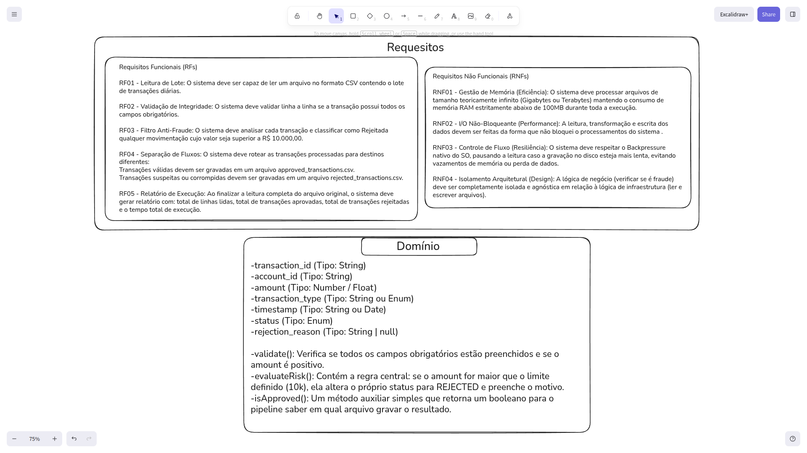
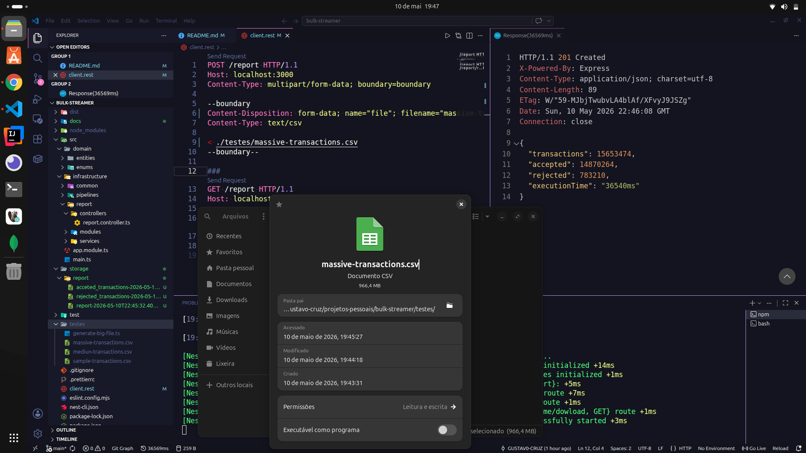

# 📦 Bulk Streamer — Mass Data Processing Engine

> Motor de ETL de alta performance focado em processamento de arquivos gigantes com consumo de memória próximo a zero utilizando Node.js Streams e Domain-Driven Design (DDD).

---

## 🚀 Status do Projeto


---

## 📌 Sobre o Projeto

O **Bulk Streamer** é uma API focada em ingestão, transformação e extração (ETL) de dados massivos.

Projetado para cenários corporativos de alta vazão (conciliação financeira, integrações bancárias), o sistema processa arquivos gigantes "gota a gota" sem sobrecarregar a memória RAM ou bloquear o Event Loop do Node.js. 

### 🧨 Problemas Resolvidos
- **Estouro de Memória (OOM):** Consumo linear e cravado (~30MB) independente do tamanho do arquivo.
- **Bloqueio de I/O:** Leitura e escrita simultâneas direto da rede para o disco.
- **"Quebra de linha":** Tratamento seguro de quebras de linha entre os *chunks* de dados.

---

## 🏗️ Arquitetura e Modelagem de Domínio

O projeto separa estritamente a **infraestrutura de I/O** (Streams, HTTP, File System) das **regras de negócio financeiras**, utilizando o padrão de Modelo de Domínio Rico (DDD). O motor apenas transporta os bytes, enquanto a Entidade dita as regras.



### 🔄 Fluxo do Pipeline ETL

1. **Interceptação (Fail-fast):** O `FormDataInterceptor` barra requisições HTTP inválidas na porta da API.
2. **Ingestão (Busboy):** Extrai a stream de bytes puros do formulário *multipart* direto da placa de rede.
3. **Transformação (ETL):** Os *chunks* são processados, as linhas convertidas em Entidades `Transaction`, e as regras de negócio são aplicadas linha a linha.
4. **Persistência Simultânea:** Os registros são separados e gravados em múltiplos arquivos `.csv` (aprovados, rejeitados, relatório geral) em tempo real.
5. **Download via Stream:** O `StreamableFile` devolve os resultados para o cliente sem carregar os arquivos na RAM.

---

## ⚡ Performance
**Ambiente de Teste (Local):**
- **Sistema Operacional:** Ubuntu Linux
- **Memória RAM:** 8 GB

**Resultado do Benchmark:**
- **Volume de Dados:** ~966 MB
- **Total de Transações:** 15.653.474 linhas
- **Tempo de Execução:** 36.5 segundos (36540ms)
- **Status:** Síncrono, contínuo e sem estourar o limite de RAM (*Out of Memory*).



---

## ⚙️ Decisões de Engenharia e Trade-offs

- **DDD (Rich Domain Model):** A pipeline não toma decisões lógicas. Toda validação de fraude e consistência de dados pertence exclusivamente à entidade `Transaction`.
- **Busboy vs. Multer:** Remoção do *middleware* tradicional de upload para impedir que o *framework* faça o *caching* do arquivo em disco/RAM antes do processamento começar.
- **Controle Promise com `events.once`:** Conversão de *callbacks* nativos em fluxo síncrono limpo, garantindo que o HTTP `201 Created` só seja retornado quando o disco confirmar a gravação do último byte.

---

## Execução Local

### 📋 Pré-requisitos
- Node.js >= 18
- npm

### ▶️ Rodando o projeto
```bash
git clone https://github.com/GUSTAV0-CRUZ/bulk-streamer.git
cd bulk-streamer
npm install
npm run start:dev
```
---

## 🛠️ Stack Tecnológica

| Categoria | Tecnologia |
|----------|-------------|
| Backend | Node.js |
| Framework | NestJS |
| Processamento | Streams API |
| Upload Parsing | Busboy |
| Arquitetura | DDD |
| Linguagem | TypeScript |

---

## 👨‍💻 Autor


**Gustavo Cruz**  
💼 Backend Developer  
📧 gustavo.cruzs.dev@gmail.com  
🔗 https://github.com/GUSTAV0-CRUZ